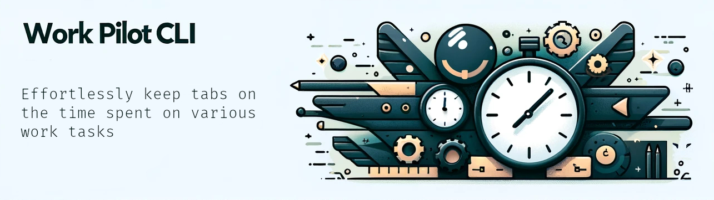
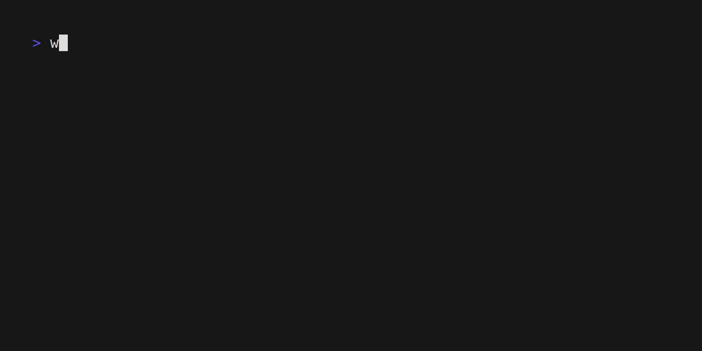

[](https://pkg.go.dev/github.com/sergiught/work-pilot-cli)
[](https://goreportcard.com/report/github.com/sergiught/work-pilot-cli)
[](https://github.com/sergiught/work-pilot-cli/releases)
[](https://github.com/sergiught/work-pilot-cli/blob/main/LICENSE.md)

---

Work Pilot CLI is a tool designed for those who seek simplicity in time management. It enables users to easily monitor
and record the time spent on various work-related tasks, all without the need for complex GUIs. It is ideal for those
who prefer a minimalist, no-frills approach to task tracking, offering a direct and fuss-free experience.



## Installation

`wp` is available as a downloadable packaged binary for Linux, macOS, and Windows from the [releases page](https://github.com/sergiught/work-pilot-cli/releases).

Or, just install it with `go`:

```shell
go install github.com/sergiught/work-pilot-cli@latest
```

## Command Reference

> [!NOTE]
> You can view the documentation on the command line with `wp help`.

There are a few basic types of commands:

- [work](): Track time spent on a work task
- [logbook](): List all work tasks with their logged time

## Feedback

I greatly value your input and ideas. Don't hesitate to initiate a discussion or open an issue to express your thoughts
about the tool, share your experience, or talk about a potential feature or issue. Your contributions are essential in
shaping and improving this project.

---

<p align="center">
This project is licensed under the MIT license.
See the <a href="https://github.com/sergiught/work-pilot-cli/blob/main/LICENSE">LICENSE</a> file for more info.
</p>
